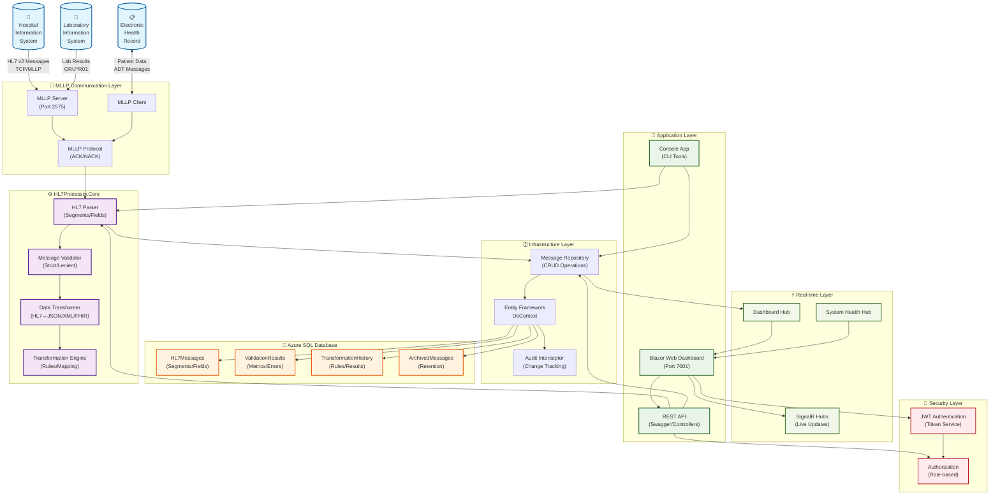

# HL7 Processor & Integration Platform

A production-ready **.NET 8** healthcare interoperability platform for parsing, transforming, and managing **HL7 v2** messages. Currently deployed on **Azure App Service** with real-time dashboards, comprehensive validation, and enterprise-grade monitoring.

Built for hospitals, laboratories and healthcare integrators who need modern, secure interoperability without vendor lock-in.

## 🌟 Live Demo
- **Web Dashboard**: [https://hl7-processor-web.azurewebsites.net](https://hl7-processor-web.azurewebsites.net)
- **API Documentation**: Available via Swagger UI on the live deployment

## 📊 Current Status
- ✅ **Production Deployed** on Azure App Service
- ✅ **Database**: Azure SQL Database with automated migrations  
- ✅ **Real-time Monitoring**: SignalR-powered live dashboards
- ✅ **Professional Structure**: Organized codebase with proper CI/CD ready setup

---
## ✨ Key Features

| Area | Highlights |
|------|------------|
| **Parsing & Validation** | • Robust HL7 v2 parser (dynamic delimiters, escape handling)<br/>• Segment/field/component models with Data-Annotation validation<br/>• Customizable validation levels (lenient ⇄ strict) |
| **Transformation & Mapping** | • Declarative field-mapping DSL<br/>• Bidirectional HL7 ↔ JSON/XML/FHIR R4 conversion<br/>• Rule engine (conditional, calculated, lookup) |
| **Transport** | • Async MLLP **client & server** with ACK/NACK handling<br/>• Connection pooling, idle-timeout management |
| **Storage** | • EF Core persistence (SQL Server by default)<br/>• Repository pattern + LINQ querying<br/>• Data-retention service & archiving hook |
| **Monitoring API** | • ASP.NET Core Web API (`/api`) for message submission & querying<br/>• SignalR hub for real-time UI updates |
| **Web Dashboard** | • Blazor Server UI with real-time metrics<br/>• HL7 message validator with parser performance tracking<br/>• Visual transformation designer & rule management<br/>• Toast notifications & professional UX |
| **Security** | • JWT-based auth (ASP.NET Identity-ready)<br/>• Audit logging via EF Core interceptors |
| **Dev Experience** | • Clean, SOLID core library<br/>• 200+ unit/integration tests (xUnit / FluentAssertions)<br/>• One-command Docker compose for DB/demo server |

---
## 🏗️ System Architecture

The HL7 Processor follows a clean architecture pattern with clear separation of concerns across multiple layers:



**Key Components:**
- **🔌 MLLP Communication Layer**: Handles reliable HL7 v2 message transmission over TCP/IP
- **⚙️ Core Processing Engine**: Business logic for HL7 message processing and transformation  
- **🚀 Application Layer**: User interfaces (Blazor Dashboard) and API endpoints
- **🗄️ Infrastructure Layer**: Data access and persistence management with Entity Framework
- **💾 Data Storage**: Azure SQL Database with comprehensive audit trails
- **⚡ Real-time Communication**: SignalR hubs for live updates and system monitoring
- **🔐 Security Layer**: JWT authentication with role-based authorization

For detailed component descriptions and data flows, see the [System Architecture Documentation](docs/SYSTEM_ARCHITECTURE.md).

---
## 🏗️ Project Structure

```
HL7/
├── src/                        # Source code
│   ├── HL7Processor.Core/          # Domain models & business logic
│   ├── HL7Processor.Infrastructure/ # EF Core, repositories, database
│   ├── HL7Processor.Api/           # REST API & SignalR hubs
│   ├── HL7Processor.Web/           # Blazor Server dashboard
│   └── HL7Processor.Console/       # CLI tools & diagnostics
├── tests/                      # Test projects
│   └── HL7Processor.Tests/         # Unit & integration tests
├── docs/                       # Documentation
│   ├── DEPLOYMENT.md               # Deployment guide
│   └── HL7-Implementation-Stages.md # Implementation roadmap
├── scripts/                    # Build & deployment scripts
│   └── deploy/                     # Azure deployment scripts
├── infrastructure/             # Infrastructure as Code (ready for use)
└── README.md                   # This file
```

---
## 🚀 Getting Started

### Prerequisites
* **.NET 8 SDK** - [Download here](https://dotnet.microsoft.com/download/dotnet/8.0)
* **SQL Server** (LocalDB, Docker, or Azure SQL) - *Optional for development*

### Quick Start - Local Development

1. **Clone and Build**
```bash
git clone <repository-url> && cd HL7
dotnet restore
dotnet build -c Release
```

2. **Run Web Dashboard** (Recommended)
```bash
cd src/HL7Processor.Web
dotnet run

# 🌐 Dashboard: https://localhost:5001
# 📊 Real-time metrics, validation, and transformation tools
```

3. **Run API Server** (Optional - for API testing)
```bash
cd src/HL7Processor.Api  
dotnet run

# 🔗 API: https://localhost:5001/api
# 📖 Swagger: https://localhost:5001/swagger
```

4. **Run Tests**
```bash
cd tests
dotnet test --verbosity normal
dotnet test --collect:"XPlat Code Coverage"  # With coverage
```

### Production Deployment

The application is production-ready and deployed on **Azure App Service**:

- **Live URL**: https://hl7-processor-web.azurewebsites.net
- **Database**: Azure SQL Database with Entity Framework migrations
- **Deployment**: Automated via Azure CLI scripts in `scripts/deploy/`

See [`docs/DEPLOYMENT.md`](docs/DEPLOYMENT.md) for detailed deployment instructions.

---
## ⚙️ Configuration

| File | Purpose |
|------|---------|
| `appsettings.json` | Global defaults |
| `appsettings.Development.json` | Overrides for dev environment |
| `appsettings.Production.json`  | Production settings (no secrets) |
| **Environment Variables** | `ConnectionStrings__Hl7Db`, `Jwt__SecretKey`, … |

### Required Environment Variables
```bash
JWT_SECRET_KEY="your-32-char-secret-key"
HL7_CONNECTION_STRING="Server=localhost,1433;Database=HL7ProcessorDb;User Id=sa;Password=YourPassword123!;Encrypt=true;TrustServerCertificate=true"
```

> Use **dotnet user-secrets** in development to avoid committing secrets.

---
## 🛠 Development Workflow
1. **Branch** from `main` → `feature/<name>`
2. Write code & **unit tests** (run `dotnet test`)
3. `git commit -s` with Conventional Commits
4. Open Pull Request → CI runs tests + analyzers
5. Code review & squash-merge

---
## 🎯 Current Capabilities

### ✅ Production Features
- **Real-time Dashboard**: Live metrics, message validation, transformation designer
- **Azure Deployment**: Fully deployed with App Service, SQL Database, and monitoring
- **Message Processing**: HL7 v2 parsing, validation, and transformation
- **Authentication**: JWT-based security with role management
- **Data Management**: Entity Framework with automated migrations and seeding
- **Professional Architecture**: Clean code, SOLID principles, comprehensive testing

### 🚧 In Development
- [ ] FHIR R4 resource conversion and enrichment
- [ ] Message routing with Azure Service Bus integration  
- [ ] Advanced transformation rule templates and visual designer
- [ ] Kubernetes deployment manifests and Helm charts
- [ ] Performance optimization and caching strategies

---
## 📖 Documentation

- **[Deployment Guide](docs/DEPLOYMENT.md)** - Azure deployment instructions
- **[Implementation Stages](docs/HL7-Implementation-Stages.md)** - Development roadmap
- **[Security Policy](SECURITY.md)** - Security guidelines and reporting

---
## 🤝 Contributing

1. Fork the repository
2. Create a feature branch: `git checkout -b feature/amazing-feature`
3. Write tests for your changes
4. Ensure all tests pass: `dotnet test`
5. Commit your changes: `git commit -m 'Add amazing feature'`
6. Push to the branch: `git push origin feature/amazing-feature`
7. Open a Pull Request

---
## 🔒 Security

This is a healthcare interoperability platform handling sensitive medical data. Security is our top priority.

- All dependencies are regularly updated
- JWT authentication with secure token handling
- SQL injection prevention via Entity Framework
- Input validation and sanitization
- Audit logging for all operations

To report security vulnerabilities, please see [SECURITY.md](SECURITY.md).

---
## 📄 License

This project is licensed under the **MIT License** – see [`LICENSE`](LICENSE) for details.

---

**Built with ❤️ for healthcare interoperability**