# HL7 Processor & Integration Platform

A production-ready **.NET 8** healthcare interoperability platform for parsing, transforming, and managing **HL7 v2** messages. Currently deployed on **Azure App Service** with real-time dashboards, comprehensive validation, and enterprise-grade monitoring.

Built for hospitals, laboratories and healthcare integrators who need modern, secure interoperability without vendor lock-in.

## 🌟 Live Demo
- **Web Dashboard**: [https://hl7-processor-web.azurewebsites.net](https://hl7-processor-web.azurewebsites.net)
- **API Documentation**: Available via Swagger UI on the live deployment

## 📊 Current Status
- ✅ **Production Deployed** on Azure App Service
- ✅ **Database**: Azure SQL Database with automated migrations  
- ✅ **Real-time Monitoring**: SignalR-powered live dashboards
- ✅ **Professional Structure**: Organized codebase with proper CI/CD ready setup

---
## ✨ Key Features

| Area | Highlights |
|------|------------|
| **Parsing & Validation** | • Robust HL7 v2 parser (dynamic delimiters, escape handling)<br/>• Segment/field/component models with Data-Annotation validation<br/>• Customizable validation levels (lenient ⇄ strict) |
| **Transformation & Mapping** | • Declarative field-mapping DSL<br/>• Bidirectional HL7 ↔ JSON/XML/FHIR R4 conversion<br/>• Rule engine (conditional, calculated, lookup) |
| **Transport** | • Async MLLP **client & server** with ACK/NACK handling<br/>• Connection pooling, idle-timeout management |
| **Storage** | • EF Core persistence (SQL Server by default)<br/>• Repository pattern + LINQ querying<br/>• Data-retention service & archiving hook |
| **Monitoring API** | • ASP.NET Core Web API (`/api`) for message submission & querying<br/>• SignalR hub for real-time UI updates |
| **Web Dashboard** | • Blazor Server UI with real-time metrics<br/>• HL7 message validator with parser performance tracking<br/>• Visual transformation designer & rule management<br/>• Toast notifications & professional UX |
| **Security** | • JWT-based auth (ASP.NET Identity-ready)<br/>• Audit logging via EF Core interceptors |
| **Dev Experience** | • Clean, SOLID core library<br/>• 200+ unit/integration tests (xUnit / FluentAssertions)<br/>• One-command Docker compose for DB/demo server |

---
## 🏗️ System Architecture

The HL7 Processor follows **Clean Architecture** principles with clear separation of concerns and proper dependency inversion across multiple layers:

```mermaid
graph TB
    %% External Systems
    HIS[("🏥<br/>Hospital<br/>Information<br/>System")]
    LIS[("🧪<br/>Laboratory<br/>Information<br/>System")]
    EHR[("📋<br/>Electronic<br/>Health<br/>Record")]
    
    %% MLLP Communication Layer
    subgraph MLLP["🔌 MLLP Communication Layer"]
        MLLPServer["MLLP Server<br/>(Port 2575)"]
        MLLPClient["MLLP Client"]
        MLLPProtocol["MLLP Protocol<br/>(ACK/NACK)"]
    end
    
    %% Presentation Layer (API Controllers)
    subgraph Presentation["🎯 Presentation Layer (API)"]
        ArchivedController["ArchivedMessages<br/>Controller"]
        MessageController["Message<br/>Controller"]
        AuthController["Auth<br/>Controller"]
        DeadLetterController["DeadLetter<br/>Controller"]
    end
    
    %% Application Layer (Use Cases)
    subgraph Application["📋 Application Layer"]
        GetArchivedUseCase["Get Archived<br/>Messages Use Case"]
        SubmitMessageUseCase["Submit Message<br/>Use Case"]
        AuthenticateUseCase["Authenticate<br/>User Use Case"]
        RequeueUseCase["Requeue Message<br/>Use Case"]
        DTOs["📦 DTOs<br/>(Data Transfer Objects)"]
        Mappers["🔄 Mappers<br/>(Entity ↔ DTO)"]
    end
    
    %% Core Domain Layer
    subgraph Core["⚙️ Core Domain Layer"]
        DomainEntities["🏗️ Domain Entities<br/>(ArchivedMessage, HL7Message)"]
        BusinessRules["📜 Business Rules<br/>(Validation, Logic)"]
        DomainInterfaces["🔌 Repository Interfaces<br/>(IArchivedMessageRepository)"]
        Parser["HL7 Parser<br/>(Segments/Fields)"]
        Validator["Message Validator<br/>(Strict/Lenient)"]
        Transformer["Data Transformer<br/>(HL7↔JSON/XML/FHIR)"]
    end
    
    %% Infrastructure Layer
    subgraph Infrastructure["🗄️ Infrastructure Layer"]
        Repositories["📚 Concrete Repositories<br/>(ArchivedMessageRepository)"]
        DbContext["Entity Framework<br/>DbContext"]
        TokenService["🔐 Token Service<br/>(JWT Implementation)"]
        AuditLog["Audit Interceptor<br/>(Change Tracking)"]
        EFEntities["💾 EF Entities<br/>(Database Models)"]
    end
    
    %% Database
    subgraph Database["💾 Azure SQL Database"]
        MessageTable["HL7Messages<br/>(Segments/Fields)"]
        ValidationTable["ValidationResults<br/>(Metrics/Errors)"]
        TransformTable["TransformationHistory<br/>(Rules/Results)"]
        ArchiveTable["ArchivedMessages<br/>(Retention)"]
    end
    
    %% UI Applications
    subgraph UI["🚀 User Interface Layer"]
        WebApp["Blazor Web Dashboard<br/>(Port 7001)"]
        Console["Console App<br/>(CLI Tools)"]
        SignalR["SignalR Hubs<br/>(Real-time Updates)"]
    end
    
    %% External connections
    HIS -->|"HL7 v2 Messages<br/>TCP/MLLP"| MLLPServer
    LIS -->|"Lab Results<br/>ORU^R01"| MLLPServer
    EHR <-->|"Patient Data<br/>ADT Messages"| MLLPClient
    
    %% MLLP to Core
    MLLPServer --> MLLPProtocol
    MLLPClient --> MLLPProtocol
    MLLPProtocol --> Parser
    
    %% Clean Architecture Dependency Flow (API → Application → Core ← Infrastructure)
    ArchivedController --> GetArchivedUseCase
    MessageController --> SubmitMessageUseCase
    AuthController --> AuthenticateUseCase
    DeadLetterController --> RequeueUseCase
    
    %% Application Layer Dependencies
    GetArchivedUseCase --> DomainInterfaces
    SubmitMessageUseCase --> DomainInterfaces
    AuthenticateUseCase --> DomainInterfaces
    RequeueUseCase --> DomainInterfaces
    GetArchivedUseCase --> Mappers
    Mappers --> DTOs
    
    %% Infrastructure Implements Core Interfaces
    Repositories -.->|implements| DomainInterfaces
    TokenService -.->|implements| DomainInterfaces
    
    %% Infrastructure to Core Domain
    Repositories --> DomainEntities
    Repositories --> BusinessRules
    
    %% Infrastructure Data Flow
    Repositories --> DbContext
    DbContext --> EFEntities
    DbContext --> AuditLog
    EFEntities --> MessageTable
    EFEntities --> ValidationTable
    EFEntities --> TransformTable
    EFEntities --> ArchiveTable
    
    %% UI Layer
    WebApp --> ArchivedController
    WebApp --> MessageController
    WebApp --> AuthController
    Console --> SubmitMessageUseCase
    SignalR --> WebApp
    
    %% Core Processing (Domain Logic)
    Parser --> Validator
    Validator --> Transformer
    Parser --> BusinessRules
    
    %% Styling
    classDef external fill:#e1f5fe,stroke:#01579b,stroke-width:2px
    classDef presentation fill:#e3f2fd,stroke:#0277bd,stroke-width:2px
    classDef application fill:#e8f5e8,stroke:#2e7d32,stroke-width:2px
    classDef core fill:#f3e5f5,stroke:#7b1fa2,stroke-width:3px
    classDef infrastructure fill:#fff3e0,stroke:#f57c00,stroke-width:2px
    classDef data fill:#fafafa,stroke:#424242,stroke-width:2px
    classDef ui fill:#f1f8e9,stroke:#558b2f,stroke-width:2px
    
    class HIS,LIS,EHR external
    class ArchivedController,MessageController,AuthController,DeadLetterController presentation
    class GetArchivedUseCase,SubmitMessageUseCase,AuthenticateUseCase,RequeueUseCase,DTOs,Mappers application
    class DomainEntities,BusinessRules,DomainInterfaces,Parser,Validator,Transformer core
    class Repositories,DbContext,TokenService,AuditLog,EFEntities infrastructure
    class MessageTable,ValidationTable,TransformTable,ArchiveTable data
    class WebApp,Console,SignalR ui
```



**Clean Architecture Principles Applied:**
- **🎯 Presentation Layer**: API Controllers depend only on Application Use Cases
- **📋 Application Layer**: Use Cases orchestrate business workflows using Domain Interfaces  
- **⚙️ Core Domain**: Contains business entities, rules, and interfaces (no external dependencies)
- **🗄️ Infrastructure Layer**: Implements Core interfaces, handles data access and external services
- **🚀 UI Layer**: User interfaces that consume the API endpoints

**Key Benefits:**
- **Dependency Inversion**: Controllers depend on abstractions, not implementations
- **Testability**: Use Cases can be unit tested in isolation
- **Maintainability**: Business logic is isolated from infrastructure concerns
- **Flexibility**: Infrastructure can be changed without affecting business logic

For detailed component descriptions and data flows, see the [System Architecture Documentation](docs/SYSTEM_ARCHITECTURE.md).

---
## 🏗️ Project Structure

The solution follows **Clean Architecture** principles with clear layer separation and dependency direction:

```
HL7/
├── src/                            # Source code organized by Clean Architecture layers
│   ├── HL7Processor.Core/              # 🎯 Domain Layer (innermost)
│   │   ├── Models/                     #   • Domain entities (ArchivedMessage, HL7Message)
│   │   ├── Interfaces/                 #   • Repository interfaces (IArchivedMessageRepository)  
│   │   ├── Parsing/                    #   • HL7 parsing logic
│   │   ├── Validation/                 #   • Business validation rules
│   │   └── Transformation/             #   • Data transformation engines
│   ├── HL7Processor.Application/       # 📋 Application Layer
│   │   ├── DTOs/                       #   • Data transfer objects
│   │   ├── UseCases/                   #   • Use case implementations
│   │   ├── Interfaces/                 #   • Application service interfaces
│   │   └── DependencyInjection.cs     #   • Service registration
│   ├── HL7Processor.Infrastructure/    # 🗄️ Infrastructure Layer  
│   │   ├── Entities/                   #   • EF Core entity models
│   │   ├── Repositories/               #   • Repository implementations
│   │   ├── Services/                   #   • External service adapters
│   │   ├── Mapping/                    #   • Entity/DTO mappers
│   │   ├── Auth/                       #   • JWT authentication
│   │   └── HL7DbContext.cs             #   • Entity Framework context
│   ├── HL7Processor.Api/               # 🎯 Presentation Layer (API)
│   │   ├── Controllers/                #   • REST API controllers
│   │   ├── Services/                   #   • Background services
│   │   └── Program.cs                  #   • Application startup
│   ├── HL7Processor.Web/               # 🚀 Presentation Layer (UI)
│   │   ├── Pages/                      #   • Blazor pages
│   │   ├── Components/                 #   • Reusable UI components
│   │   ├── Services/                   #   • UI-specific services
│   │   └── Hubs/                       #   • SignalR real-time hubs
│   └── HL7Processor.Console/           # 🛠️ CLI Tools
│       └── Program.cs                  #   • Command-line interface
├── tests/                          # Test projects
│   ├── HL7Processor.Tests/             # Unit & integration tests
│   └── HL7Processor.Web.Tests/         # UI component tests
├── docs/                           # Documentation
│   ├── DEPLOYMENT.md                   # Deployment guide
│   ├── SYSTEM_ARCHITECTURE.md          # Detailed architecture docs
│   └── HL7-Implementation-Stages.md    # Implementation roadmap
├── scripts/                        # Build & deployment scripts
│   └── deploy/                         # Azure deployment scripts
├── infrastructure/                 # Infrastructure as Code
├── CLEAN_ARCHITECTURE_REFACTORING_SUMMARY.md # Refactoring documentation
└── README.md                       # This file
```

### 🔄 Dependency Flow (Clean Architecture)
```
Presentation Layer (API/Web)
        ↓ depends on
Application Layer (Use Cases)  
        ↓ depends on
Domain Layer (Core) ← implements ← Infrastructure Layer
```

**Key Principles:**
- **Core**: No external dependencies, pure business logic
- **Application**: Orchestrates workflows, depends only on Core
- **Infrastructure**: Implements Core interfaces, handles external concerns
- **Presentation**: Depends on Application layer, not Infrastructure directly

---
## 🚀 Getting Started

### Prerequisites
* **.NET 8 SDK** - [Download here](https://dotnet.microsoft.com/download/dotnet/8.0)
* **SQL Server** (LocalDB, Docker, or Azure SQL) - *Optional for development*

### Quick Start - Local Development

1. **Clone and Build**
```bash
git clone <repository-url> && cd HL7
dotnet restore
dotnet build -c Release
```

2. **Run Web Dashboard** (Recommended)
```bash
cd src/HL7Processor.Web
dotnet run

# 🌐 Dashboard: https://localhost:5001
# 📊 Real-time metrics, validation, and transformation tools
```

3. **Run API Server** (Optional - for API testing)
```bash
cd src/HL7Processor.Api  
dotnet run

# 🔗 API: https://localhost:5001/api
# 📖 Swagger: https://localhost:5001/swagger
```

4. **Run Tests**
```bash
cd tests
dotnet test --verbosity normal
dotnet test --collect:"XPlat Code Coverage"  # With coverage
```

### Production Deployment

The application is production-ready and deployed on **Azure App Service**:

- **Live URL**: https://hl7-processor-web.azurewebsites.net
- **Database**: Azure SQL Database with Entity Framework migrations
- **Deployment**: Automated via Azure CLI scripts in `scripts/deploy/`

See [`docs/DEPLOYMENT.md`](docs/DEPLOYMENT.md) for detailed deployment instructions.

---
## ⚙️ Configuration

| File | Purpose |
|------|---------|
| `appsettings.json` | Global defaults |
| `appsettings.Development.json` | Overrides for dev environment |
| `appsettings.Production.json`  | Production settings (no secrets) |
| **Environment Variables** | `ConnectionStrings__Hl7Db`, `Jwt__SecretKey`, … |

### Required Environment Variables
```bash
JWT_SECRET_KEY="your-32-char-secret-key"
HL7_CONNECTION_STRING="Server=localhost,1433;Database=HL7ProcessorDb;User Id=sa;Password=YourPassword123!;Encrypt=true;TrustServerCertificate=true"
```

> Use **dotnet user-secrets** in development to avoid committing secrets.

---
## 🛠 Development Workflow
1. **Branch** from `main` → `feature/<name>`
2. Write code & **unit tests** (run `dotnet test`)
3. `git commit -s` with Conventional Commits
4. Open Pull Request → CI runs tests + analyzers
5. Code review & squash-merge

---
## 🎯 Current Capabilities

### ✅ Production Features
- **Real-time Dashboard**: Live metrics, message validation, transformation designer
- **Azure Deployment**: Fully deployed with App Service, SQL Database, and monitoring
- **Message Processing**: HL7 v2 parsing, validation, and transformation
- **Authentication**: JWT-based security with role management
- **Data Management**: Entity Framework with automated migrations and seeding
- **Professional Architecture**: Clean code, SOLID principles, comprehensive testing

### 🚧 In Development
- [ ] FHIR R4 resource conversion and enrichment
- [ ] Message routing with Azure Service Bus integration  
- [ ] Advanced transformation rule templates and visual designer
- [ ] Kubernetes deployment manifests and Helm charts
- [ ] Performance optimization and caching strategies

---
## 📖 Documentation

- **[Deployment Guide](docs/DEPLOYMENT.md)** - Azure deployment instructions
- **[Implementation Stages](docs/HL7-Implementation-Stages.md)** - Development roadmap
- **[Security Policy](SECURITY.md)** - Security guidelines and reporting

---
## 🤝 Contributing

1. Fork the repository
2. Create a feature branch: `git checkout -b feature/amazing-feature`
3. Write tests for your changes
4. Ensure all tests pass: `dotnet test`
5. Commit your changes: `git commit -m 'Add amazing feature'`
6. Push to the branch: `git push origin feature/amazing-feature`
7. Open a Pull Request

---
## 🔒 Security

This is a healthcare interoperability platform handling sensitive medical data. Security is our top priority.

- All dependencies are regularly updated
- JWT authentication with secure token handling
- SQL injection prevention via Entity Framework
- Input validation and sanitization
- Audit logging for all operations

To report security vulnerabilities, please see [SECURITY.md](SECURITY.md).

---
## 📄 License

This project is licensed under the **MIT License** – see [`LICENSE`](LICENSE) for details.

---

**Built with ❤️ for healthcare interoperability**