# HL7 Processor System Architecture

This document provides a comprehensive overview of the HL7 Processor system architecture, including all major components, data flows, and integration points.

## System Overview

The HL7 Processor is a production-ready .NET 8 healthcare interoperability platform designed for parsing, transforming, and managing HL7 v2 messages. The system follows **Clean Architecture** principles with proper dependency inversion and clear separation of concerns across multiple layers.

## ✅ Recent Architecture Improvements

The system has been refactored to follow Clean Architecture principles:
- **Application Layer**: Added dedicated use cases for business operations
- **Domain Layer**: Pure business logic with no external dependencies  
- **Infrastructure Layer**: Implements domain interfaces, handles data access
- **Dependency Inversion**: Controllers depend on abstractions, not implementations

**Key Benefits:**
- Improved testability through isolated use cases
- Better maintainability with clear separation of concerns
- Enhanced flexibility for infrastructure changes
- Proper dependency flow following SOLID principles

## Clean Architecture Diagram

```mermaid
graph TB
    %% External Systems
    HIS[("🏥<br/>Hospital<br/>Information<br/>System")]
    LIS[("🧪<br/>Laboratory<br/>Information<br/>System")]
    EHR[("📋<br/>Electronic<br/>Health<br/>Record")]
    
    %% MLLP Communication Layer
    subgraph MLLP["🔌 MLLP Communication Layer"]
        MLLPServer["MLLP Server<br/>(Port 2575)"]
        MLLPClient["MLLP Client"]
        MLLPProtocol["MLLP Protocol<br/>(ACK/NACK)"]
    end
    
    %% Presentation Layer (API Controllers)
    subgraph Presentation["🎯 Presentation Layer (API)"]
        ArchivedController["ArchivedMessages<br/>Controller"]
        MessageController["Message<br/>Controller"]
        AuthController["Auth<br/>Controller"]
        DeadLetterController["DeadLetter<br/>Controller"]
    end
    
    %% Application Layer (Use Cases)
    subgraph Application["📋 Application Layer"]
        GetArchivedUseCase["Get Archived<br/>Messages Use Case"]
        SubmitMessageUseCase["Submit Message<br/>Use Case"]
        AuthenticateUseCase["Authenticate<br/>User Use Case"]
        RequeueUseCase["Requeue Message<br/>Use Case"]
        DTOs["📦 DTOs<br/>(Data Transfer Objects)"]
        Mappers["🔄 Mappers<br/>(Entity ↔ DTO)"]
    end
    
    %% Core Domain Layer
    subgraph Core["⚙️ Core Domain Layer"]
        DomainEntities["🏗️ Domain Entities<br/>(ArchivedMessage, HL7Message)"]
        BusinessRules["📜 Business Rules<br/>(Validation, Logic)"]
        DomainInterfaces["🔌 Repository Interfaces<br/>(IArchivedMessageRepository)"]
        Parser["HL7 Parser<br/>(Segments/Fields)"]
        Validator["Message Validator<br/>(Strict/Lenient)"]
        Transformer["Data Transformer<br/>(HL7↔JSON/XML/FHIR)"]
    end
    
    %% Infrastructure Layer
    subgraph Infrastructure["🗄️ Infrastructure Layer"]
        Repositories["📚 Concrete Repositories<br/>(ArchivedMessageRepository)"]
        DbContext["Entity Framework<br/>DbContext"]
        TokenService["🔐 Token Service<br/>(JWT Implementation)"]
        AuditLog["Audit Interceptor<br/>(Change Tracking)"]
        EFEntities["💾 EF Entities<br/>(Database Models)"]
    end
    
    %% Database
    subgraph Database["💾 Azure SQL Database"]
        MessageTable["HL7Messages<br/>(Segments/Fields)"]
        ValidationTable["ValidationResults<br/>(Metrics/Errors)"]
        TransformTable["TransformationHistory<br/>(Rules/Results)"]
        ArchiveTable["ArchivedMessages<br/>(Retention)"]
    end
    
    %% UI Applications
    subgraph UI["🚀 User Interface Layer"]
        WebApp["Blazor Web Dashboard<br/>(Port 7001)"]
        Console["Console App<br/>(CLI Tools)"]
        SignalR["SignalR Hubs<br/>(Real-time Updates)"]
    end
    
    %% Background Services
    subgraph Background["⏰ Background Services"]
        DataRetention["Data Retention Service<br/>(Cleanup/Archive)"]
        HealthMonitor["System Health Monitor"]
    end
    
    %% External connections
    HIS -->|"HL7 v2 Messages<br/>TCP/MLLP"| MLLPServer
    LIS -->|"Lab Results<br/>ORU^R01"| MLLPServer
    EHR <-->|"Patient Data<br/>ADT Messages"| MLLPClient
    
    %% MLLP to Core
    MLLPServer --> MLLPProtocol
    MLLPClient --> MLLPProtocol
    MLLPProtocol --> Parser
    
    %% Clean Architecture Dependency Flow (API → Application → Core ← Infrastructure)
    ArchivedController --> GetArchivedUseCase
    MessageController --> SubmitMessageUseCase
    AuthController --> AuthenticateUseCase
    DeadLetterController --> RequeueUseCase
    
    %% Application Layer Dependencies
    GetArchivedUseCase --> DomainInterfaces
    SubmitMessageUseCase --> DomainInterfaces
    AuthenticateUseCase --> DomainInterfaces
    RequeueUseCase --> DomainInterfaces
    GetArchivedUseCase --> Mappers
    Mappers --> DTOs
    
    %% Infrastructure Implements Core Interfaces
    Repositories -.->|implements| DomainInterfaces
    TokenService -.->|implements| DomainInterfaces
    
    %% Infrastructure to Core Domain
    Repositories --> DomainEntities
    Repositories --> BusinessRules
    
    %% Infrastructure Data Flow
    Repositories --> DbContext
    DbContext --> EFEntities
    DbContext --> AuditLog
    EFEntities --> MessageTable
    EFEntities --> ValidationTable
    EFEntities --> TransformTable
    EFEntities --> ArchiveTable
    
    %% UI Layer
    WebApp --> ArchivedController
    WebApp --> MessageController
    WebApp --> AuthController
    Console --> SubmitMessageUseCase
    SignalR --> WebApp
    
    %% Core Processing (Domain Logic)
    Parser --> Validator
    Validator --> Transformer
    Parser --> BusinessRules
    
    %% Background Services
    DataRetention --> ArchiveTable
    HealthMonitor --> DbContext
    
    %% Styling
    classDef external fill:#e1f5fe,stroke:#01579b,stroke-width:2px
    classDef presentation fill:#e3f2fd,stroke:#0277bd,stroke-width:2px
    classDef application fill:#e8f5e8,stroke:#2e7d32,stroke-width:2px
    classDef core fill:#f3e5f5,stroke:#7b1fa2,stroke-width:3px
    classDef infrastructure fill:#fff3e0,stroke:#f57c00,stroke-width:2px
    classDef data fill:#fafafa,stroke:#424242,stroke-width:2px
    classDef ui fill:#f1f8e9,stroke:#558b2f,stroke-width:2px
    
    class HIS,LIS,EHR external
    class ArchivedController,MessageController,AuthController,DeadLetterController presentation
    class GetArchivedUseCase,SubmitMessageUseCase,AuthenticateUseCase,RequeueUseCase,DTOs,Mappers application
    class DomainEntities,BusinessRules,DomainInterfaces,Parser,Validator,Transformer core
    class Repositories,DbContext,TokenService,AuditLog,EFEntities infrastructure
    class MessageTable,ValidationTable,TransformTable,ArchiveTable data
    class WebApp,Console,SignalR ui
```



## Clean Architecture Layers

### 🎯 Presentation Layer (API Controllers)
**Responsibility**: Handle HTTP requests and responses, coordinate with Application layer

- **ArchivedMessagesController**: Manages archived message operations via use cases
- **MessageController**: Handles HL7 message submission through use cases  
- **AuthController**: Authentication operations using application services
- **DeadLetterController**: Dead letter queue management via use cases

**Key Principles:**
- Controllers depend only on Application layer interfaces
- No direct access to Infrastructure or Data concerns
- Thin controllers that delegate to use cases

### 📋 Application Layer (Use Cases & Orchestration)
**Responsibility**: Orchestrate business workflows, coordinate between domain and infrastructure

- **Use Cases**: Business operation implementations (GetArchivedMessagesUseCase, SubmitMessageUseCase, etc.)
- **DTOs**: Data transfer objects for external communication
- **Mappers**: Convert between domain entities and DTOs
- **Application Services**: Coordinate complex workflows

**Key Principles:**
- Contains application-specific business rules
- Depends only on Core domain layer
- Infrastructure implements Application interfaces

### ⚙️ Core Domain Layer (Business Logic)
**Responsibility**: Pure business logic, domain entities, and business rules

- **Domain Entities**: Rich domain models with business logic (ArchivedMessage, HL7Message)
- **Repository Interfaces**: Contracts for data access (IArchivedMessageRepository)
- **Business Rules**: Domain validation and business logic
- **Domain Services**: Core HL7 processing (Parser, Validator, Transformer)

**Key Principles:**
- No external dependencies (innermost layer)
- Contains all business logic and rules
- Infrastructure implements domain interfaces

### 🗄️ Infrastructure Layer (External Concerns)
**Responsibility**: Implement domain interfaces, handle external systems and data persistence

- **Concrete Repositories**: Implement domain repository interfaces
- **Entity Framework Context**: Database access and ORM mapping
- **External Services**: JWT token service, external API adapters
- **Database Entities**: EF Core entity models
- **Mapping Services**: Entity-to-domain mapping

**Key Principles:**
- Implements Core domain interfaces
- Handles all external dependencies
- Can be replaced without affecting business logic

### 🚀 User Interface Layer (Applications)
**Responsibility**: User-facing applications that consume the API

- **Blazor Web Dashboard**: Interactive web interface
- **Console Application**: Command-line tools
- **SignalR Hubs**: Real-time communication

**Benefits of This Architecture:**
- **Testability**: Each layer can be tested in isolation
- **Maintainability**: Changes to infrastructure don't affect business logic
- **Flexibility**: Easy to swap infrastructure implementations
- **Clear Dependencies**: Explicit dependency direction prevents architectural erosion

---

## Component Details

### 🔌 MLLP Communication Layer
**Purpose**: Handles reliable HL7 v2 message transmission over TCP/IP

- **MLLP Server**: Listens for incoming HL7 messages on port 2575 (configurable)
- **MLLP Client**: Sends HL7 messages to external systems
- **MLLP Protocol**: Implements framing with start/end delimiters and ACK/NACK handling

### ⚙️ Core Processing Engine
**Purpose**: Business logic for HL7 message processing and transformation

- **HL7 Parser**: Parses raw HL7 messages into structured segments and fields
- **Message Validator**: Validates messages with configurable strictness levels
- **Data Transformer**: Converts between HL7, JSON, XML, and FHIR formats
- **Transformation Engine**: Applies mapping rules and business logic

### 🚀 Application Layer
**Purpose**: User interfaces and API endpoints

- **Blazor Web Dashboard**: Real-time web UI with metrics, validation, and transformation tools
- **REST API**: HTTP endpoints for message submission and querying with Swagger documentation
- **Console App**: CLI tools for diagnostics and batch processing

### 🗄️ Infrastructure Layer
**Purpose**: Data access and persistence management

- **Entity Framework DbContext**: ORM for database operations
- **Message Repository**: Repository pattern for CRUD operations
- **Archived Message Service**: Business logic layer for archived message operations with proper DTOs
- **Audit Interceptor**: Automatic change tracking for compliance

### 💾 Data Storage
**Purpose**: Persistent storage of messages and metadata

- **HL7Messages**: Core message data with segments and fields
- **ValidationResults**: Validation metrics and error tracking
- **TransformationHistory**: Transformation audit trail and performance metrics
- **ArchivedMessages**: Long-term retention and compliance storage

### 📬 Message Queue System
**Purpose**: Asynchronous message processing and error handling

- **In-Memory Queue**: Development and simple deployments
- **Dead Letter Queue**: Failed message handling and retry logic

### ⚡ Real-time Communication
**Purpose**: Live updates and system monitoring

- **SignalR Hubs**: WebSocket-based real-time communication
- **Dashboard Hub**: Live metrics and message status updates
- **System Hub**: Health monitoring and system status

### 🔐 Security Layer
**Purpose**: Authentication and authorization

- **JWT Authentication**: Token-based authentication with configurable expiration
- **Role-based Authorization**: Admin/User role separation with policy-based access

### ⏰ Background Services
**Purpose**: Automated maintenance and monitoring

- **Data Retention Service**: Automated cleanup and archiving based on retention policies
- **System Health Monitor**: Continuous health checks and performance monitoring

## Data Flow

### 1. Message Ingestion
```
External System → MLLP Server → Parser → Validator → Repository → Database
```

### 2. Message Transformation
```
Parser → Transformation Engine → Format Converters → Output (JSON/XML/FHIR)
```

### 3. Real-time Updates
```
Repository Changes → SignalR Hubs → Web Dashboard (Live Updates)
```

### 4. API Operations
```
Client → REST API → Authentication → Service Layer → Repository/Core → Response
```

### 5. Clean Architecture Flow (Updated)
```
Controller → IArchivedMessageService → ArchivedMessageService → DbContext → Database
```

## Key Features

### ✅ Production Ready
- **Azure Deployment**: Fully deployed on Azure App Service with SQL Database
- **Real-time Monitoring**: Live dashboards with SignalR
- **Enterprise Security**: JWT authentication with audit logging
- **Automated Testing**: 200+ unit and integration tests

### 🔄 Message Processing
- **HL7 v2 Support**: Comprehensive parsing for all major message types
- **Format Conversion**: Bidirectional HL7 ↔ JSON/XML/FHIR transformation
- **Validation Levels**: Configurable strict/lenient validation
- **Error Handling**: Dead letter queues and retry mechanisms

### 📊 Monitoring & Analytics
- **Performance Metrics**: Parser performance and throughput tracking
- **System Health**: Real-time health indicators and alerts
- **Audit Trail**: Complete transformation and validation history
- **Data Retention**: Configurable archiving and cleanup policies

### 🔧 Developer Experience
- **Clean Architecture**: SOLID principles with clear separation of concerns following Clean/Onion Architecture patterns
- **Service Layer Pattern**: Business logic abstracted behind interfaces (e.g., IArchivedMessageService)
- **Typed DTOs**: Proper data transfer objects instead of generic object types
- **Extensible Design**: Plugin architecture for custom transformations
- **Comprehensive Testing**: Unit, integration, and performance tests
- **Documentation**: Detailed API documentation with Swagger

## Deployment Architecture

### Development Environment
- **Local Database**: SQL Server LocalDB or Docker container
- **In-Memory Queue**: Simple queue implementation for development
- **Self-signed Certificates**: HTTPS development certificates

### Production Environment (Azure)
- **Azure App Service**: Scalable web application hosting
- **Azure SQL Database**: Managed database with automated backups
- **Application Insights**: Monitoring and telemetry
- **Azure Key Vault**: Secure secret management

## Integration Points

### External Systems
- **Hospital Information Systems (HIS)**: Patient admissions, transfers, discharges
- **Laboratory Information Systems (LIS)**: Lab results and orders
- **Electronic Health Records (EHR)**: Comprehensive patient data

### Message Types Supported
- **ADT Messages**: Patient administration (A01, A08, etc.)
- **ORU Messages**: Observation results (R01)
- **ORM Messages**: Orders and order management
- **Query Messages**: Patient and data queries
- **Acknowledgments**: ACK/NACK responses

## Security Considerations

### Data Protection
- **Encryption in Transit**: TLS 1.2+ for all external communications
- **Encryption at Rest**: Azure SQL Database transparent data encryption
- **PII Handling**: Proper handling of protected health information

### Access Control
- **Authentication**: JWT tokens with configurable expiration
- **Authorization**: Role-based access control (Admin/User)
- **Audit Logging**: Complete audit trail for compliance

### Compliance
- **HIPAA Ready**: Designed with healthcare compliance in mind
- **Data Retention**: Configurable retention policies
- **Change Tracking**: Audit interceptors for all data modifications

## Performance Characteristics

### Throughput
- **Message Processing**: 1000+ messages per second (depending on message size)
- **Concurrent Connections**: 100+ simultaneous MLLP connections
- **Database Operations**: Optimized with Entity Framework and connection pooling

### Scalability
- **Horizontal Scaling**: Stateless design supports multiple instances
- **Database Scaling**: Azure SQL Database auto-scaling capabilities
- **Queue Scaling**: Ready for Azure Service Bus integration

### Monitoring
- **Real-time Metrics**: Live performance dashboards
- **Health Checks**: Automated system health monitoring
- **Alerting**: Configurable alerts for system issues

---

This architecture provides a robust, scalable, and maintainable foundation for healthcare interoperability while ensuring security, compliance, and performance requirements are met. 