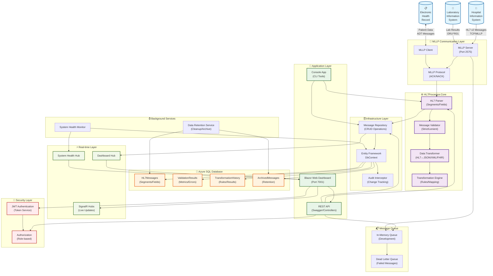

# HL7 Processor System Architecture

This document provides a comprehensive overview of the HL7 Processor system architecture, including all major components, data flows, and integration points.

## System Overview

The HL7 Processor is a production-ready .NET 8 healthcare interoperability platform designed for parsing, transforming, and managing HL7 v2 messages. The system follows a clean architecture pattern with clear separation of concerns across multiple layers.

## Architecture Diagram



## Component Details

### 🔌 MLLP Communication Layer
**Purpose**: Handles reliable HL7 v2 message transmission over TCP/IP

- **MLLP Server**: Listens for incoming HL7 messages on port 2575 (configurable)
- **MLLP Client**: Sends HL7 messages to external systems
- **MLLP Protocol**: Implements framing with start/end delimiters and ACK/NACK handling

### ⚙️ Core Processing Engine
**Purpose**: Business logic for HL7 message processing and transformation

- **HL7 Parser**: Parses raw HL7 messages into structured segments and fields
- **Message Validator**: Validates messages with configurable strictness levels
- **Data Transformer**: Converts between HL7, JSON, XML, and FHIR formats
- **Transformation Engine**: Applies mapping rules and business logic

### 🚀 Application Layer
**Purpose**: User interfaces and API endpoints

- **Blazor Web Dashboard**: Real-time web UI with metrics, validation, and transformation tools
- **REST API**: HTTP endpoints for message submission and querying with Swagger documentation
- **Console App**: CLI tools for diagnostics and batch processing

### 🗄️ Infrastructure Layer
**Purpose**: Data access and persistence management

- **Entity Framework DbContext**: ORM for database operations
- **Message Repository**: Repository pattern for CRUD operations
- **Audit Interceptor**: Automatic change tracking for compliance

### 💾 Data Storage
**Purpose**: Persistent storage of messages and metadata

- **HL7Messages**: Core message data with segments and fields
- **ValidationResults**: Validation metrics and error tracking
- **TransformationHistory**: Transformation audit trail and performance metrics
- **ArchivedMessages**: Long-term retention and compliance storage

### 📬 Message Queue System
**Purpose**: Asynchronous message processing and error handling

- **In-Memory Queue**: Development and simple deployments
- **Dead Letter Queue**: Failed message handling and retry logic

### ⚡ Real-time Communication
**Purpose**: Live updates and system monitoring

- **SignalR Hubs**: WebSocket-based real-time communication
- **Dashboard Hub**: Live metrics and message status updates
- **System Hub**: Health monitoring and system status

### 🔐 Security Layer
**Purpose**: Authentication and authorization

- **JWT Authentication**: Token-based authentication with configurable expiration
- **Role-based Authorization**: Admin/User role separation with policy-based access

### ⏰ Background Services
**Purpose**: Automated maintenance and monitoring

- **Data Retention Service**: Automated cleanup and archiving based on retention policies
- **System Health Monitor**: Continuous health checks and performance monitoring

## Data Flow

### 1. Message Ingestion
```
External System → MLLP Server → Parser → Validator → Repository → Database
```

### 2. Message Transformation
```
Parser → Transformation Engine → Format Converters → Output (JSON/XML/FHIR)
```

### 3. Real-time Updates
```
Repository Changes → SignalR Hubs → Web Dashboard (Live Updates)
```

### 4. API Operations
```
Client → REST API → Authentication → Core Processing → Response
```

## Key Features

### ✅ Production Ready
- **Azure Deployment**: Fully deployed on Azure App Service with SQL Database
- **Real-time Monitoring**: Live dashboards with SignalR
- **Enterprise Security**: JWT authentication with audit logging
- **Automated Testing**: 200+ unit and integration tests

### 🔄 Message Processing
- **HL7 v2 Support**: Comprehensive parsing for all major message types
- **Format Conversion**: Bidirectional HL7 ↔ JSON/XML/FHIR transformation
- **Validation Levels**: Configurable strict/lenient validation
- **Error Handling**: Dead letter queues and retry mechanisms

### 📊 Monitoring & Analytics
- **Performance Metrics**: Parser performance and throughput tracking
- **System Health**: Real-time health indicators and alerts
- **Audit Trail**: Complete transformation and validation history
- **Data Retention**: Configurable archiving and cleanup policies

### 🔧 Developer Experience
- **Clean Architecture**: SOLID principles with clear separation of concerns
- **Extensible Design**: Plugin architecture for custom transformations
- **Comprehensive Testing**: Unit, integration, and performance tests
- **Documentation**: Detailed API documentation with Swagger

## Deployment Architecture

### Development Environment
- **Local Database**: SQL Server LocalDB or Docker container
- **In-Memory Queue**: Simple queue implementation for development
- **Self-signed Certificates**: HTTPS development certificates

### Production Environment (Azure)
- **Azure App Service**: Scalable web application hosting
- **Azure SQL Database**: Managed database with automated backups
- **Application Insights**: Monitoring and telemetry
- **Azure Key Vault**: Secure secret management

## Integration Points

### External Systems
- **Hospital Information Systems (HIS)**: Patient admissions, transfers, discharges
- **Laboratory Information Systems (LIS)**: Lab results and orders
- **Electronic Health Records (EHR)**: Comprehensive patient data

### Message Types Supported
- **ADT Messages**: Patient administration (A01, A08, etc.)
- **ORU Messages**: Observation results (R01)
- **ORM Messages**: Orders and order management
- **Query Messages**: Patient and data queries
- **Acknowledgments**: ACK/NACK responses

## Security Considerations

### Data Protection
- **Encryption in Transit**: TLS 1.2+ for all external communications
- **Encryption at Rest**: Azure SQL Database transparent data encryption
- **PII Handling**: Proper handling of protected health information

### Access Control
- **Authentication**: JWT tokens with configurable expiration
- **Authorization**: Role-based access control (Admin/User)
- **Audit Logging**: Complete audit trail for compliance

### Compliance
- **HIPAA Ready**: Designed with healthcare compliance in mind
- **Data Retention**: Configurable retention policies
- **Change Tracking**: Audit interceptors for all data modifications

## Performance Characteristics

### Throughput
- **Message Processing**: 1000+ messages per second (depending on message size)
- **Concurrent Connections**: 100+ simultaneous MLLP connections
- **Database Operations**: Optimized with Entity Framework and connection pooling

### Scalability
- **Horizontal Scaling**: Stateless design supports multiple instances
- **Database Scaling**: Azure SQL Database auto-scaling capabilities
- **Queue Scaling**: Ready for Azure Service Bus integration

### Monitoring
- **Real-time Metrics**: Live performance dashboards
- **Health Checks**: Automated system health monitoring
- **Alerting**: Configurable alerts for system issues

---

This architecture provides a robust, scalable, and maintainable foundation for healthcare interoperability while ensuring security, compliance, and performance requirements are met. 